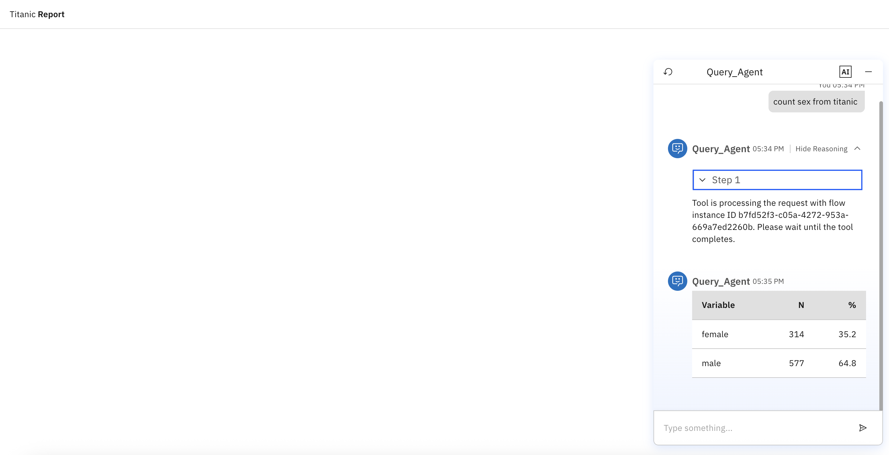

# [Watson Orchestrate ADK](https://developer.watson-orchestrate.ibm.com/)

## Setup

### Configuring `.env`

```
WO_INSTANCE=<service_instance_url>
WO_API_KEY=<wxo_api_key>
S3_REGION=<region>
S3_ENDPOINT=<endpoint>
S3_ACCESS_KEY_ID=<access_key_id>
S3_SECRET_ACCESS_KEY=<secret_access_key>
```

### Install ADK

```bash
virtualenv venv
source venv/bin/activate
pip install ibm-watsonx-orchestrate
```

### Running in the Cloud

```bash
# Read environment variables
source .env

# Adding an environment
orchestrate env add --name my-orchestrate --url $WO_INSTANCE --type ibm_iam

# Activate
orchestrate env activate my-orchestrate --api-key $WO_API_KEY

# Starting your ADK project
mkdir -p adk-project/{agents,tools,knowledge}

adk-project
├── agents
│   └── query_agent.py
├── knowledge
│   ├── database_knowledge.py
│   └── database_knowledge.txt
└── tools
    ├── generate_report.py
    ├── markdown_format.py
    ├── query_data_flow.py
    └── query_data.py

# Set connection
orchestrate connections add -a cos_connection
orchestrate connections configure -a cos_connection --env draft --kind key_value --type team
orchestrate connections set-credentials -a cos_connection -k key_value --env draft \
-e S3_REGION=$S3_REGION \
-e S3_ENDPOINT=$S3_ENDPOINT \
-e S3_ACCESS_KEY_ID_READ=$S3_ACCESS_KEY_ID_READ \
-e S3_SECRET_ACCESS_KEY_READ=$S3_SECRET_ACCESS_KEY_READ \
-e S3_ACCESS_KEY_ID_WRITE=$S3_ACCESS_KEY_ID_WRITE \
-e S3_SECRET_ACCESS_KEY_WRITE=$S3_SECRET_ACCESS_KEY_WRITE

orchestrate connections configure -a cos_connection --env live --kind key_value --type team
orchestrate connections set-credentials -a cos_connection -k key_value --env live \
-e S3_REGION=$S3_REGION \
-e S3_ENDPOINT=$S3_ENDPOINT \
-e S3_ACCESS_KEY_ID_READ=$S3_ACCESS_KEY_ID_READ \
-e S3_SECRET_ACCESS_KEY_READ=$S3_SECRET_ACCESS_KEY_READ \
-e S3_ACCESS_KEY_ID_WRITE=$S3_ACCESS_KEY_ID_WRITE \
-e S3_SECRET_ACCESS_KEY_WRITE=$S3_SECRET_ACCESS_KEY_WRITE

# Create tools
source venv/bin/activate
pip install -r requirements.txt
orchestrate tools import -k python -f adk-project/tools/query_data.py -a cos_connection -r requirements.txt
orchestrate tools import -k python -f adk-project/tools/markdown_format.py -r requirements.txt
orchestrate tools import -k python -p adk-project/tools -f adk-project/tools/generate_report.py -a cos_connection -r requirements.txt

# Create flow
orchestrate tools import -k flow -p adk-project/tools/ -f adk-project/tools/query_data_flow.py

# Create knowledge
orchestrate knowledge-bases import -f adk-project/knowledge/database_knowledge.py 
orchestrate knowledge-bases status -n database_knowledge

# Create agent
orchestrate agents import -f adk-project/agents/query_agent.py
```

## [Watsonx Orchestrate Developer Edition](https://developer.watson-orchestrate.ibm.com/developer_edition/wxOde_overview)

### Configuring `.env`

```
WO_DEVELOPER_EDITION_SOURCE=orchestrate
WO_INSTANCE=<service_instance_url>
WO_API_KEY=<wxo_api_key>
```

### Running the Local Environment

```bash
orchestrate server start -e .env
orchestrate env activate local
orchestrate chat start
```

### Create tool and agent

```bash
orchestrate tools import -k python -f adk-project/tools/consulta_cep.py -r requirements.txt
orchestrate agents import -f adk-project/agents/cep_agent.py
```

### Langflow

```bash
orchestrate server start -e .env --with-langflow
```

## [Using agents in embedded webchat](https://developer.watson-orchestrate.ibm.com/manage/channels#embedded-chat-security)

